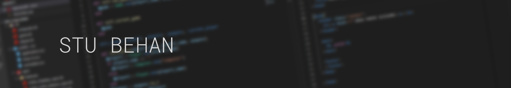

## Hi there 👋

I'm currently working on a Unified API for the HRIS/ATS sector built on Typescript/Nestjs backend & Ruby on Rails front end.

## Experience with:

## And these tools:

  

<a href="https://github.com/devicons/devicon">
 Icons by devicon
</a>

<!--
**StuBehan/StuBehan** is a ✨ _special_ ✨ repository because its `README.md` (this file) appears on your GitHub profile.

Here are some ideas to get you started:

- 🔭 I’m currently working on ...
- 🌱 I’m currently learning ...
- 👯 I’m looking to collaborate on ...
- 🤔 I’m looking for help with ...
- 💬 Ask me about ...
- 📫 How to reach me: ...
- 😄 Pronouns: ...
- ⚡ Fun fact: ...
-->
